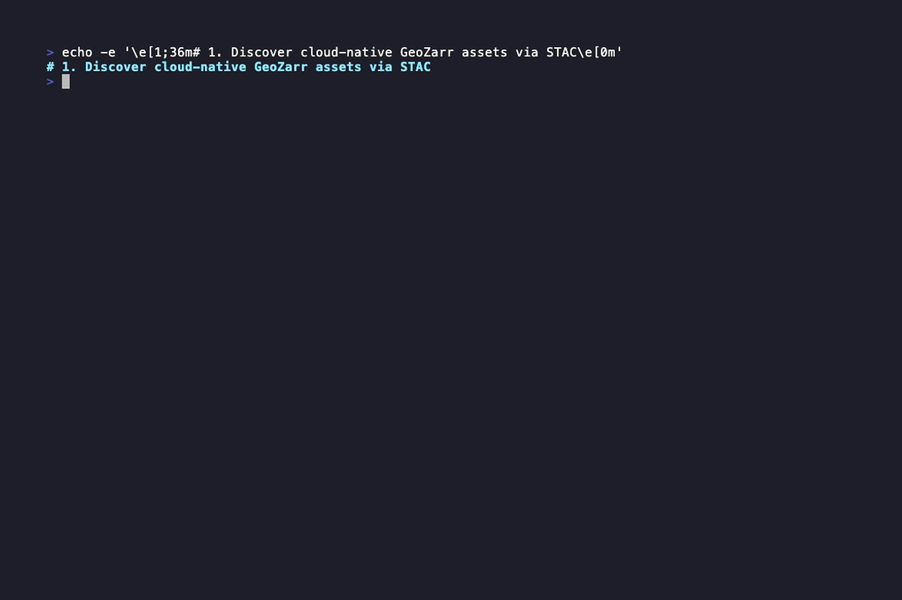

# DuckDB GeoZarr

A high-performance, cloud-native [DuckDB](https://duckdb.org/) extension for reading and writing N-dimensional [Zarr](https://zarr.readthedocs.io/) and GeoZarr arrays directly as flat relational tables.



[](https://github.com/dnf0/duckdb_geozarr/actions/workflows/release.yaml)

📖 **[Read the Full Documentation here!](https://dnf0.github.io/duckdb_geozarr/)**

## Performance

Benchmarked against `xarray` + `shapely` on the [CMIP6 CESM2 historical surface temperature dataset](https://storage.googleapis.com/cmip6/CMIP6/CMIP/NCAR/CESM2/historical/r1i1p1f1/Amon/tas/gn/v20190308/) hosted on Google Cloud Storage (~1° resolution, 1980 monthly steps, 1850–2014). Query: extract all grid cells within the California bounding box (−125°–−115°, 30°–45°).

### Extraction: chunk granularity matters

| Tool | Download | Time | Note |
|---|---|---|---|
| zarrduck | 506 MB | ~48 s | Full spatial chunk (192×288 grid = whole globe) |
| xarray + shapely | ~42 MB | ~8 s | Server-side lat slice before download |
| zarrduck (spatially chunked¹) | 38 MB | ~2.2 s | Only intersecting chunks fetched |
| xarray (spatially chunked¹) | ~2 MB | ~0.9 s | Server-side bbox slice |

> ¹ Local Zarr re-chunked to 73×144 (2.5° grid). Chunk granularity is the dominant factor — zarrduck's spatial pruning skips non-intersecting chunks entirely, but cannot partially read within a chunk.

**Takeaway:** zarrduck matches or beats xarray when the Zarr store is chunked at a spatial granularity that aligns with query regions. For datasets with single global spatial chunks (common in CMIP6), xarray's coordinate-aware server-side slicing downloads less data.

### Scan throughput: release build + parallel chunks

The extension scales near-linearly with DuckDB's thread pool. Benchmarked on a locally-chunked Zarr (79 chunks, 12×73×144, California bbox extraction, 32,830 rows):

| Build | Threads | Time | Speedup |
|---|---|---|---|
| debug | 1 | 1,472 ms | 1× (baseline) |
| release | 1 | 313 ms | 4.7× |
| release | 4 | 99 ms | 14.9× |
| release | 8 | 65 ms | **22.6×** |

> Use a release build in production (`cargo build --release`). Each chunk is assigned to a separate DuckDB worker thread, so throughput scales with both CPU cores and I/O parallelism.

### Post-extraction analytics: zarrduck's sweet spot

Once data is extracted into DuckDB (32,830 rows, California CMIP6), subsequent SQL queries are near-instant and compose freely with other DuckDB tables — no IPC or Python overhead:

| Query | DuckDB | pandas (equiv.) |
|---|---|---|
| Spatial mean (GROUP BY lat, lon) | 0.7 ms | ~0.5 ms |
| Top-N hottest months | 0.7 ms | ~0.4 ms |
| Decadal trend | 0.7 ms | ~3.6 ms |
| Monthly anomaly | 0.8 ms | ~0.3 ms |

Overall scan rate: **~174 M rows/s** on extracted data. The extraction cost is paid once; every subsequent query is free in DuckDB's vectorized engine.

## Why DuckDB GeoZarr?

Geospatial and climate data are frequently stored in Zarr format because it enables efficient, chunked, and compressed storage of multi-dimensional arrays (like Time × Latitude × Longitude). However, querying this data traditionally required loading it into Python (via `xarray` or `zarr-python`) before performing analytics, introducing massive IPC (Inter-Process Communication) and memory overhead.

This project bridges the gap with two tools:
1. **The DuckDB Extension:** Natively streams remote Zarr chunks directly into DuckDB's vectorized execution engine for lightning-fast reads.
2. **`geozarr-cli`:** A companion CLI tool that executes SQL against your data and asynchronously uploads the results back to cloud storage as an N-dimensional Zarr array.

### Key Features
- **Zero-Copy Streaming**: Chunks are loaded, decompressed, and decoded natively inside DuckDB's engine.
- **Lock-Free Parallel Scanning**: Achieves maximum S3 throughput by utilizing DuckDB's multi-threaded worker pool to fetch and decode multiple chunks simultaneously.
- **Cloud Native**: Powered by Apache OpenDAL, natively supporting reading and writing from local filesystems, `s3://`, `http://`, and `https://` with standard AWS credentials.
- **Spatial Pruning**: Filter data at the chunk-level using bounding boxes (`lat_min`, `lon_max`), preventing out-of-bounds S3 requests before they are ever made.
- **Universal Types**: Supports all common Zarr primitives (`f32`, `f64`, `i8`, `i16`, `i32`, `i64`, `u8`, `u16`, `u32`, `u64`, `bool`, and `String`).
- **Missing Data Awareness**: Missing data tokens (Zarr `fill_value`s) are mapped perfectly to true SQL `NULL`s via DuckDB's `ValidityMask`.
- **GeoZarr Spec Alignment**: Natively parses GeoZarr `spatial` affine transforms to project grid coordinates into geographic coordinates (e.g., `lon`, `lat`) on-the-fly, and exposes global properties like `crs` via `read_zarr_metadata()`.

## Quick Start (Reading)

Download the `.duckdb_extension` binary for your platform from the [Releases page](https://github.com/dnf0/duckdb_geozarr/releases), or build it from source.

```sql
-- Allow unsigned extensions
SET allow_unsigned_extensions = true;

-- Load the extension
LOAD '/path/to/duckdb_geozarr.duckdb_extension';

-- Query a remote Zarr array, aggregating over a specific spatial bounding box
SELECT
    time,
    AVG(value) as mean_temp
FROM read_zarr(
    's3://climate-data/temperature.zarr',
    lat_min := 45.0,
    lat_max := 55.0
)
GROUP BY time;
```

## Zarrduck CLI (Agentic Data Engine)

The companion `zarrduck` CLI allows you to perform complex spatial operations and STAC discoveries directly from the terminal. It features a powerful, multi-level interactive Terminal User Interface (TUI) for human users, while remaining fully LLM-agent friendly via the `--output=json` flag.

```bash
# 1. Multi-Level STAC Discovery (Interactive TUI)
# Run without arguments to launch the guided interactive explorer.
# Navigate Providers -> Collections -> Dataset URIs -> Zarr Channels
# Supports smart multi-word filtering and STAC descriptions!
zarrduck search --bbox -122.27,37.77,-122.22,37.81

# 2. Vector-Raster Extraction
# Downloads only intersecting chunks and joins spatial pixels with vector polygons
zarrduck extract climate_data.zarr/air_temperature ./my_region.geojson --out analysis.duckdb

# 3. Temporal Analytics
# Resample massive time-series data to coarser frequencies (e.g., monthly averages)
zarrduck resample analysis.duckdb monthly.duckdb --freq month --agg avg

# 4. Interactive SQL Shell
# Drop into a spatial-enabled REPL to query your extracted data
zarrduck shell monthly.duckdb
```

## Development

The project is structured as a Cargo workspace:
- `extension/`: The core DuckDB loadable extension.
- `cli/`: The companion `geozarr-cli` export tool.

To build both:
```bash
git clone https://github.com/dnf0/duckdb_geozarr.git
cd duckdb_geozarr
cargo build --release
```

## Documentation

Full documentation on installation, advanced spatial pruning, and architecture details can be found at [dnf0.github.io/duckdb_geozarr/](https://dnf0.github.io/duckdb_geozarr/).
