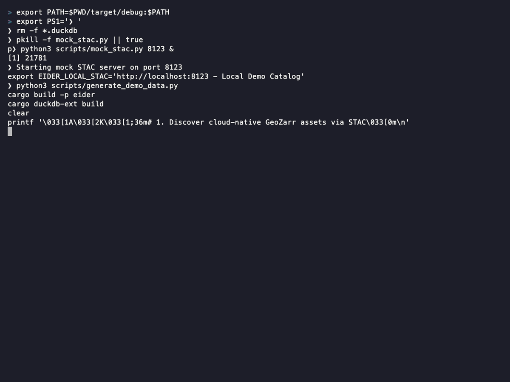

# Eider

A high-performance, cloud-native [DuckDB](https://duckdb.org/) extension for reading and writing N-dimensional [Zarr](https://zarr.readthedocs.io/) and GeoZarr arrays directly as flat relational tables.



[](https://github.com/dnf0/eider/actions/workflows/release.yaml)

📖 **[Read the Full Documentation here!](https://dnf0.github.io/eider/)**

## Performance

Eider was designed to push the physical limits of network I/O and single-core SIMD throughput. It matches or beats the fastest available Python Zarr library (even the Rust-backed `zarrs` pipeline) because it avoids generating physical numpy arrays inside Python, instead streaming directly into DuckDB vectors.

Generating a block of 2,048 projected coordinates natively inside the extension costs **~9.5 µs**, making the math essentially free compared to network latency.

📊 **[View the interactive performance benchmarks on our documentation site!](https://dnf0.github.io/eider/docs/engineering/benchmarks)**

## Why Eider?

Geospatial and climate data are frequently stored in Zarr format because it enables efficient, chunked, and compressed storage of multi-dimensional arrays (like Time × Latitude × Longitude). However, querying this data traditionally required loading it into Python (via `xarray` or `zarr-python`) before performing analytics, introducing massive IPC (Inter-Process Communication) and memory overhead.

This project bridges the gap with two tools:
1. **The DuckDB Extension:** Natively streams remote Zarr chunks directly into DuckDB's vectorized execution engine for lightning-fast reads.
2. **`eider` CLI:** A companion CLI tool that serves as an agentic spatial data engine for GeoZarr and DuckDB. It allows users to discover dataset metadata (`eider info`) and extract Zarr data intersecting with vector polygons (`eider extract`).

### Key Features
- **Zero-Copy Streaming**: Chunks are loaded, decompressed, and decoded natively inside DuckDB's engine.
- **Lock-Free Parallel Scanning**: Achieves maximum S3 throughput by utilizing DuckDB's multi-threaded worker pool to fetch and decode multiple chunks simultaneously.
- **Cloud Native**: Powered by Apache OpenDAL, natively supporting reading and writing from local filesystems, `s3://`, `http://`, and `https://` with standard AWS credentials.
- **Spatial Pruning**: Filter data at the chunk-level using bounding boxes (`lat_min`, `lon_max`), preventing out-of-bounds S3 requests before they are ever made.
- **Universal Types**: Supports all common Zarr primitives (`f32`, `f64`, `i8`, `i16`, `i32`, `i64`, `u8`, `u16`, `u32`, `u64`, `bool`, and `String`).
- **Missing Data Awareness**: Missing data tokens (Zarr `fill_value`s) are mapped perfectly to true SQL `NULL`s via DuckDB's `ValidityMask`.
- **GeoZarr Spec Alignment**: Natively parses GeoZarr `spatial` affine transforms to project grid coordinates into geographic coordinates (e.g., `lon`, `lat`) on-the-fly, and exposes global properties like `crs` via `read_zarr_metadata()`.

## Quick Start (Reading)

Download the `.duckdb_extension` binary for your platform from the [Releases page](https://github.com/dnf0/eider/releases), or build it from source.

```sql
-- Allow unsigned extensions
SET allow_unsigned_extensions = true;

-- Load the extension
LOAD '/path/to/eider_extension.duckdb_extension';

-- Query a remote Zarr array, aggregating over a specific spatial bounding box
SELECT
    time,
    AVG(value) as mean_temp
FROM read_zarr(
    's3://climate-data/temperature.zarr',
    lat_min := 45.0,
    lat_max := 55.0
)
GROUP BY time;
```

## Eider CLI (Agentic Data Engine)

The companion `eider` CLI allows you to perform complex spatial operations and STAC discoveries directly from the terminal. It features a powerful, multi-level interactive Terminal User Interface (TUI) for human users, while remaining fully LLM-agent friendly via the `--output=json` flag.

```bash
# 1. Multi-Level STAC Discovery (Interactive TUI)
# Run without arguments to launch the guided interactive explorer.
# Navigate Providers -> Collections -> Dataset URIs -> Zarr Channels
# Supports smart multi-word filtering and STAC descriptions!
eider search --bbox -122.27,37.77,-122.22,37.81

# 2. Vector-Raster Extraction
# Downloads only intersecting chunks and joins spatial pixels with vector polygons
eider extract climate_data.zarr/air_temperature ./my_region.geojson --out analysis.duckdb

# 3. Temporal Analytics
# Resample massive time-series data to coarser frequencies (e.g., monthly averages)
eider resample analysis.duckdb monthly.duckdb --freq month --agg avg

# 4. Interactive SQL Shell
# Drop into a spatial-enabled REPL to query your extracted data
eider shell monthly.duckdb
```

## Development

## Architecture & Execution Strategy
The project is structured as a Cargo workspace:
- `geozarr_core/`: The deep, pure Rust domain model handling Zarr metadata, coordinate projection, bounds validation, and types. Free from sink-specific (e.g., DuckDB) or UI dependencies.
- `extension/`: The core DuckDB loadable extension, acting as a thin C-API adapter over `geozarr_core`.
- `cli/`: The companion `eider` extraction and analysis tool, acting as a command router.

To build the project:
```bash
git clone https://github.com/dnf0/eider.git
cd eider
cargo build --release
```

## Documentation

Full documentation on installation, advanced spatial pruning, and architecture details can be found at [dnf0.github.io/eider/](https://dnf0.github.io/eider/).
