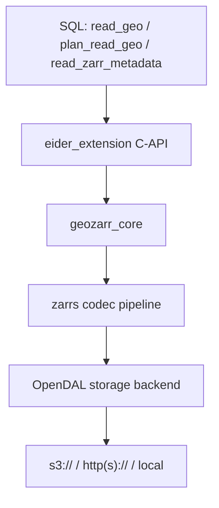

# System Architecture

Eider is a DuckDB extension that bridges DuckDB's C-API vectorized execution
engine with Rust-based geospatial logic. A SQL query flows through the
extension into `geozarr_core`, which drives the [`zarrs`](https://docs.rs/zarrs)
codec pipeline over an [Apache OpenDAL](https://opendal.apache.org/) storage
backend.

## Entry points

The extension registers three table functions (`extension/src/lib.rs`):

- `read_geo` — read array values, with spatial/temporal pushdown.
- `plan_read_geo` — dry-run cost estimate (`total_chunks`, `total_bytes`).
- `read_zarr_metadata` — array shape, chunk shape, data type, CRS.

A query binds in `ReadGeoVTab::bind()` (`extension/src/table_function.rs`),
which opens the dataset via `geozarr_core::dataset::ZarrDataset::open`. That
resolves a storage backend (`geozarr_core::store::resolve_sync_store`) and opens
the array through `zarrs`.

## Concurrency model

Eider does **not** run its own thread pool — it has no `tokio` or `rayon`
dependency in the extension. Instead it cooperates with DuckDB's query-engine
threads:

1. At bind time the extension calls `set_max_threads(num_chunks)`, telling
   DuckDB how much parallelism the scan can use (one unit of work per chunk).
2. DuckDB spins up worker threads. Each thread is handed a thread-local
   `LocalState` (keyed by thread id) that tracks its current chunk.
3. To get its next unit of work, a thread locks a shared `GlobalState`
   grid iterator (a `Mutex`) and pops the next chunk coordinate. It then
   reads and decodes that chunk independently and writes the result into its
   DuckDB output vector.

In other words, chunks are distributed across DuckDB's worker threads via a
**shared work-queue guarded by a mutex** — a small critical section to hand out
the next coordinate, with the expensive fetch/decode then happening without any
shared lock, independently *per thread*. (The mutex is a real coordination
point rather than a wait-free hand-off, but for typical chunk counts the
contention on that brief critical section is negligible next to network
latency.) The async network I/O itself is driven by OpenDAL inside the store
wrapper.

## Codec & format support

The `zarrs` pipeline is built (`extension/Cargo.toml`) with support for the
**Blosc**, **Gzip**, **Zstd**, and **CRC32C** codecs, plus **sharding**,
**transpose**, and **ndarray** features. Both Zarr **V2** and **V3** arrays are
supported.
