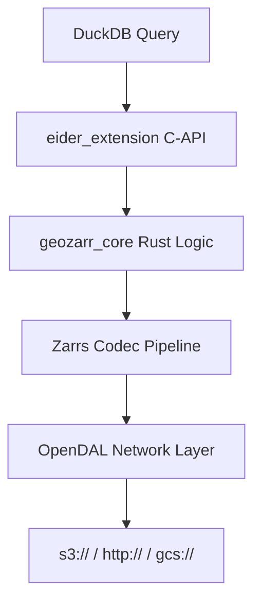

# System Architecture

Eider bridges the gap between Rust-based spatial logic and DuckDB's C-API vectorized execution engine.

## Multi-threading Model
When `read_zarr` is initialized, DuckDB allocates a pool of background workers. Eider dispatches individual chunk read requests to these workers lock-free, saturating available network bandwidth and CPU cores.
