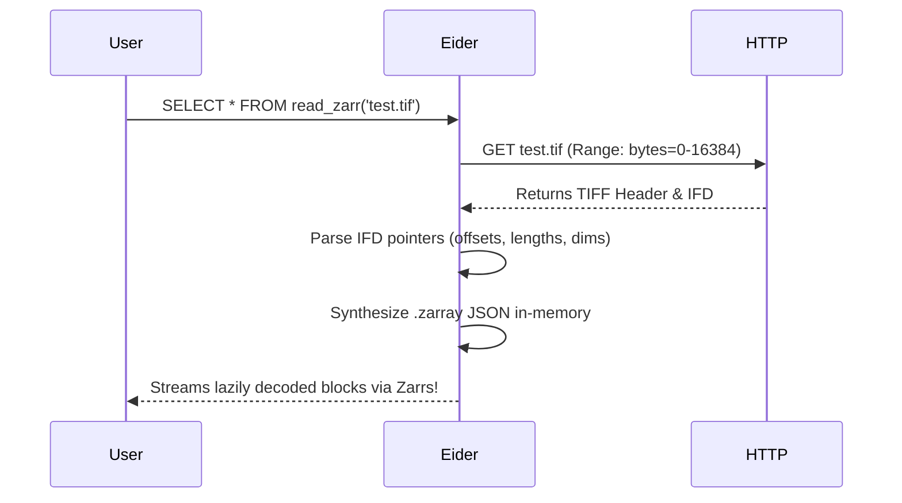

# COG Virtualization

Eider natively reads Cloud Optimized GeoTIFFs (COGs) by "tricking" the Zarr decoding pipeline.

## Zero-Copy Translation
Instead of downloading the file or rewriting it to Zarr, Eider generates virtual Zarr chunk boundaries that perfectly map to the COG's internal byte-ranges. Benchmarks show synthesizing this `.zarray` takes **~2.4ms** for a 10,000-tile COG.
