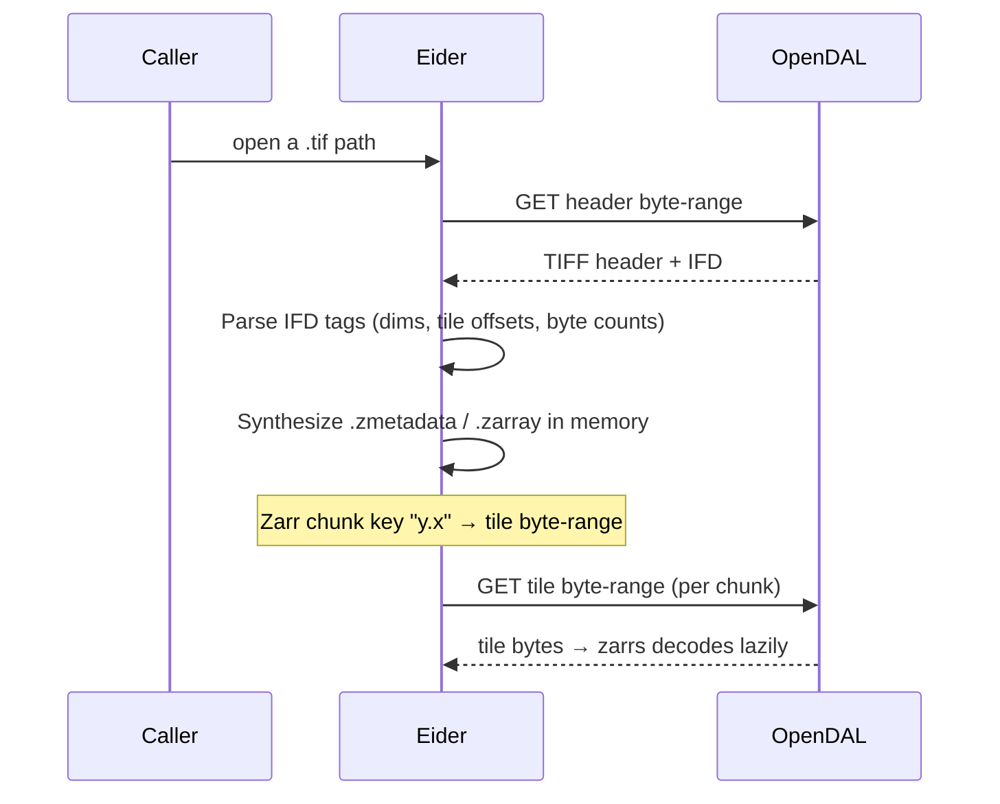

# COG Virtualization

:::note Status
COG is a first-class `read_geo` source: `read_geo('path.tif')` and
`read_zarr_metadata('path.tif')` return georeferenced, type-correct results.
:::

Eider can read a Cloud Optimized GeoTIFF (COG) without downloading or converting
it, by presenting the COG to the `zarrs` pipeline as if it were a Zarr array.

## How it works

1. **Parse the TIFF.** `geozarr_core/src/cog.rs` reads the byte-order mark and
   IFD offset, then extracts the tags it needs: image width/length (256/257),
   tile width/length (322/323), and the per-tile offsets and byte counts
   (324/325).
2. **Synthesize a virtual Zarr array.** `VirtualCogStore`
   (`geozarr_core/src/virtual_store.rs`) generates `.zmetadata` and `.zarray`
   JSON in memory describing an array whose chunk shape equals the COG's tile
   shape.
3. **Map chunks to byte-ranges.** A Zarr chunk key of the form `"y.x"` is
   translated to the corresponding tile's `(offset, length)` and served by a
   single OpenDAL range GET; `zarrs` then decodes the tile lazily.

`resolve_sync_store` (`geozarr_core/src/store.rs`) detects `.tif`/`.tiff` paths
and instantiates the `VirtualCogStore` automatically, so the rest of the
pipeline is identical to reading a real Zarr array.

## Supported & limitations

**Supported:** single-band GeoTIFFs; uncompressed and Deflate-compressed tiles
(predictor=1); the GeoTIFF affine (`ModelPixelScale`/`ModelTiepoint` or
`ModelTransformation`) and CRS (`GeoKeyDirectory`). For a geographic CRS
(EPSG:4326) the dimensions are `lat`/`lon`, so `lat_min`/`lon_max` bounding-box
pushdown applies; the value column uses the COG's real data type.

**Not yet supported:** multi-band COGs; LZW/JPEG/WebP internal compression;
horizontal-differencing predictors; CRS reprojection (projected COGs are read
in their native CRS with `y`/`x` dimensions, so geographic bbox pushdown does
not apply). These return a clear error or fall back to unfiltered reads.

## STAC (planned, not yet wired to SQL)

A `VirtualStacStore` exists in `geozarr_core` that parses a STAC Item, extracts
its COG assets, and composes them as a set of virtual COG stores
(`geozarr_core/src/virtual_stac_store.rs`). However, the `read_geo` SQL function currently
**returns an explicit error** for STAC paths
(`extension/src/table_function.rs`) — STAC consumption from SQL is planned but
not yet wired up. Until then, STAC sources are not queryable through the
extension.
