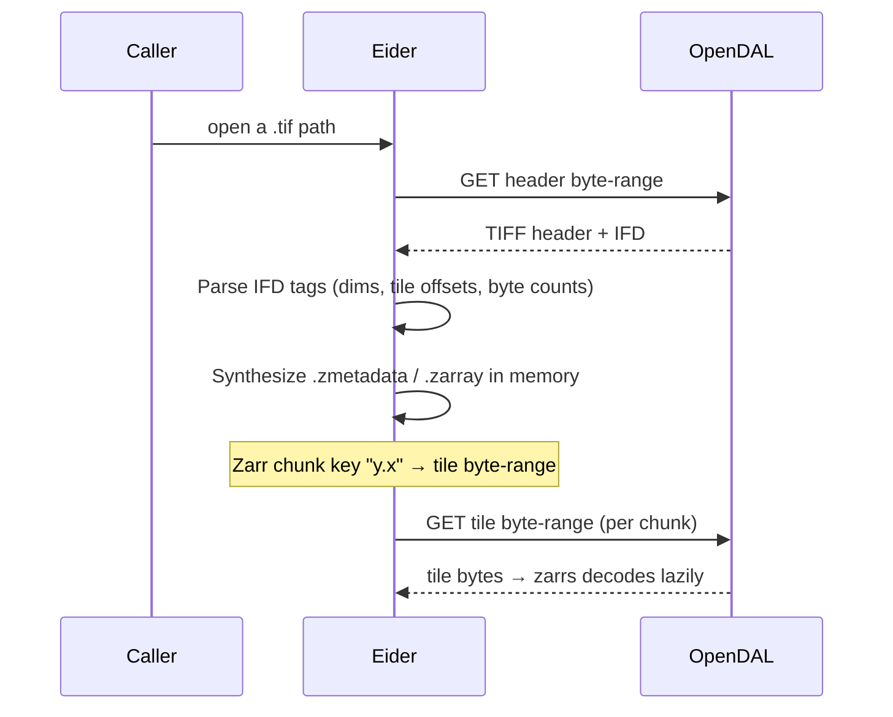

# COG Virtualization

:::note Status
COG is a first-class `read_geo` source: `read_geo('path.tif')` and
`read_zarr_metadata('path.tif')` return georeferenced, type-correct results.
:::

Eider can read a Cloud Optimized GeoTIFF (COG) without downloading or converting
it, by presenting the COG to the `zarrs` pipeline as if it were a Zarr array.



## How it works

1. **Parse the TIFF.** `geozarr_core/src/cog.rs` reads the byte-order mark and
   IFD offset, then extracts the tags it needs: image width/length (256/257),
   tile width/length (322/323), and the per-tile offsets and byte counts
   (324/325).
2. **Synthesize a virtual Zarr array.** `VirtualCogStore`
   (`geozarr_core/src/virtual_store.rs`) generates `.zmetadata` and `.zarray`
   JSON in memory describing an array whose chunk shape equals the COG's tile
   shape.
3. **Map chunks to byte-ranges.** A Zarr chunk key of the form `"y.x"` is
   translated to the corresponding tile's `(offset, length)` and served by a
   single OpenDAL range GET; `zarrs` then decodes the tile lazily.

`resolve_sync_store` (`geozarr_core/src/store.rs`) detects `.tif`/`.tiff` paths
and instantiates the `VirtualCogStore` automatically, so the rest of the
pipeline is identical to reading a real Zarr array.

## Supported & limitations

**Supported:** single-band GeoTIFFs; uncompressed and Deflate-compressed tiles
(predictor=1); the GeoTIFF affine (`ModelPixelScale`/`ModelTiepoint` or
`ModelTransformation`) and CRS (`GeoKeyDirectory`). For a geographic CRS
(EPSG:4326) the dimensions are `lat`/`lon`, so `lat_min`/`lon_max` bounding-box
pushdown applies; the value column uses the COG's real data type.

**Not yet supported:** Unsupported band counts (multi-band COGs), bit-depths,
sample formats, and compression schemes (LZW/JPEG/WebP, horizontal-differencing
predictors) return a clear error at open time rather than silently misreading
the data. CRS reprojection is the one exception: projected COGs are read in
their native CRS with `y`/`x` dimensions, so geographic bounding-box pushdown
simply does not apply (no error — the data is read correctly, just without
geographic bbox pruning).

## STAC

### Single Item

A single STAC **Item** is a first-class `read_geo` source. Eider fetches the
Item (local path or `http(s)://`), composes its COG assets as a virtual Zarr
group, and you select one asset:

```sql
SELECT * FROM read_geo('item.json', asset := 'red');
```

If the Item has exactly one COG asset it is selected automatically; with
multiple assets and none chosen, `read_geo` errors listing the available asset
names. Each selected asset is read with the full COG pipeline (real dtype,
GeoTIFF affine, CRS).

### ItemCollection time-stacking

A STAC **ItemCollection** / `FeatureCollection` (a local file or a single
`http(s)://` response) stacks the selected asset across its Items into a 3D
`[time, lat, lon]` array. The `time` coordinate is **epoch seconds** parsed from
each Item's `properties.datetime`; Items are sorted ascending, so
`time_min`/`time_max` (given as epoch seconds) filter by real time:

```sql
SELECT * FROM read_geo('itemcollection.json', asset := 'red',
                       time_min := 1767225600, time_max := 1769904000);
```

The collection must be **grid-uniform** — every Item and asset must share the
same shape, affine, and CRS, and each asset's data type must be uniform across
Items. If anything differs, `read_geo` errors naming the offending Item rather
than silently misaligning slices (there is no regridding or reprojection).

**Not yet supported:** STAC API **pagination** (a `rel:next` link is ignored —
only the provided response is stacked); **multi-resolution** collections (assets
with differing grids); Items without `properties.datetime`; stacking multiple
assets into one array; and STAC Collection/Catalog traversal — these return a
clear error.
