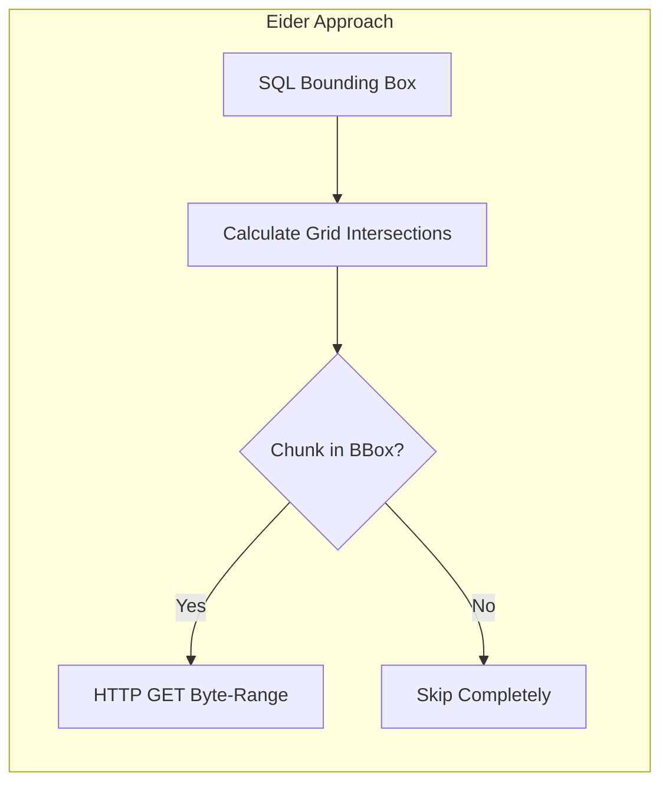

# Spatial Pruning

Traditional Python spatial tools (like Xarray with Zarr-Python) often suffer from the "N+1 Problem" when pulling remote chunks.

By pushing `lat_min` and `lon_max` down into `geozarr_core`, Eider determines exactly which chunks contain relevant data mathematically using the affine transform. It never issues HTTP requests for data it knows it will drop.
