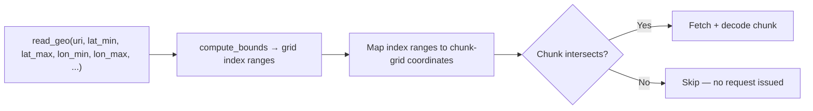

# Spatial Pruning

When you constrain a query with a bounding box, Eider fetches only the chunks
that intersect it. The bounds are pushed down into `geozarr_core` and resolved
to grid indices *before* any data is read, so non-matching chunks are never
requested over the network.

## From bounds to indices

The named parameters `lat_min`/`lat_max`/`lon_min`/`lon_max`/`time_min`/
`time_max` are bound in `extension/src/table_function.rs` and passed to
`ZarrDataset::compute_bounds`. For each dimension, Eider resolves the requested
value range to an index range one of two ways:

- **Coordinate-array dimensions** (the dimension has an explicit coordinate
  array, e.g. a `lat` array): a binary search (`partition_point`) over the
  sorted coordinate values maps each bound to an index
  (`geozarr_core/src/query_planner.rs`).
- **Affine-transform dimensions** (the dimension is described by a
  `scale`/`translation` transform rather than a stored array): the inverse
  transform `index = (value − translation) / scale` computes the index range
  directly, with no coordinate array fetched
  (`geozarr_core/src/dataset.rs`).

## From indices to chunks

The resolved per-dimension index ranges are converted to chunk-grid
coordinates, and the scan iterates **only** the chunks covering those ranges
(`extension/src/table_function.rs`). A chunk outside every dimension's range is
never enumerated, so no byte-range request is ever issued for it.

## Estimating the read first

`plan_read_geo` runs exactly this pruning logic but stops before fetching,
returning `total_chunks` and `total_bytes` for the chunks that *would* be read.
Use it to size a query before running it — see the
[SQL Reference](../usage/sql_plan_read_geo.md).
