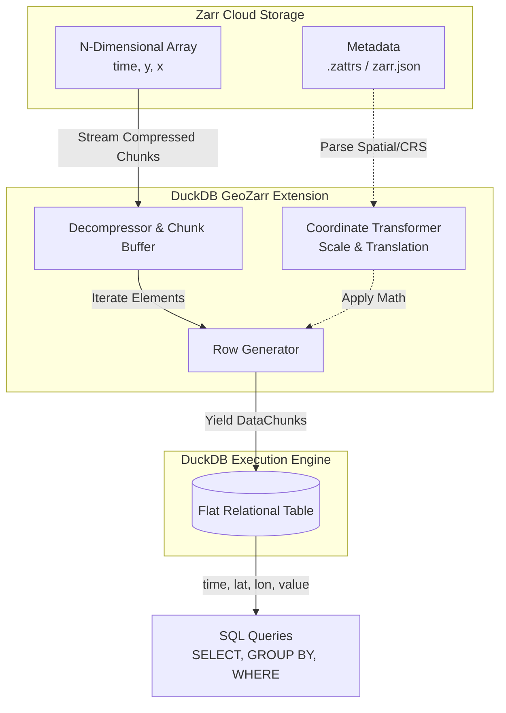

# Architecture Deep Dive

The DuckDB GeoZarr extension is designed with a heavy focus on network I/O optimization, memory safety, and lock-free concurrency. It relies on the [zarrs](https://crates.io/crates/zarrs) crate for core Zarr decoding and the [opendal](https://crates.io/crates/opendal) crate for cloud storage abstraction.

## Conceptual Model: From Zarr to DuckDB

The fundamental challenge in bridging cloud-native spatial data with relational engines is the impedance mismatch between N-Dimensional Arrays (Zarr) and Flat Tabular Rows (DuckDB).

### How the Transformation Works



### Why is this useful?

1. **Standardization:** Traditional N-dimensional tools require learning specific Python APIs (`xarray`, `dask`). By projecting the data into a flat table, anyone (and any LLM Agent) who knows SQL can immediately analyze massive datasets.
2. **Ecosystem Integration:** Flattened relational data seamlessly integrates with business intelligence tools, web dashboards, and standard spatial analysis workflows (like joining climate data against a flat table of customer locations).
3. **On-the-Fly Projection:** Because the extension parses the GeoZarr spatial metadata and projects indices into true `lat`/`lon` geographic coordinates automatically, users never have to manually reconstruct the spatial grid or apply coordinate math.
4. **Network Optimization:** By keeping data compressed on S3 in chunked Zarr arrays and using spatial pruning parameters (e.g., `lat_min`), we dramatically reduce network latency by bypassing S3 requests for data outside the region of interest.

## Flattened Relational Mapping

DuckDB operates on flat, relational tables, whereas Zarr arrays are N-dimensional. The extension bridges this gap by "flattening" the N-dimensional array into a Cartesian table.

For a 3D Zarr array with dimensions `[time, lat, lon]`, the extension yields four columns:
```text
time | lat | lon | value
-----+-----+-----+------
 100 | 45. | -10 | 23.4
 100 | 45. |  -9 | 24.1
 100 | 46. | -10 | 22.8
```

Each discrete "cell" in the Zarr array becomes a single row in DuckDB.

### Eager Coordinate Loading
To populate the coordinate columns efficiently, the extension inspects the `_ARRAY_DIMENSIONS` metadata. It then looks for 1D arrays matching those names in the same Zarr store (e.g., `/lat`).

During the `bind` phase (before the query execution begins), these 1D coordinate arrays are eagerly loaded into memory in their entirety. During the execution phase, as the extension yields data chunks, it calculates the global N-dimensional index of each value, and uses that integer index to perform an O(1) lookup into the cached coordinate arrays.

## Parallel Scanning (Lock-Free I/O)

DuckDB's extension API typically expects table scans to execute synchronously, maintaining state internally. However, network I/O (fetching chunks from S3) is incredibly slow compared to DuckDB's in-memory vectorized processing. If multiple threads wait on a single lock to fetch data, the CPU starves.

To achieve maximum throughput, the extension implements a **simulated Thread-Local State** architecture:

1. **Global Dispatcher:** A lightweight, Mutex-protected `GlobalState` tracks the progression through the Zarr chunk grid. It acts purely as an atomic counter to dictate *which* chunk needs to be fetched next.
2. **Local Processing:** The global query initialization data holds a thread-safe `HashMap` mapping DuckDB's native `std::thread::ThreadId` to a `LocalState` buffer.
3. **Lock-Free Fetching:** When a DuckDB worker thread needs a new chunk, it locks the `GlobalState` for mere nanoseconds to claim its target chunk coordinates. It then **drops all locks** and uses OpenDAL to download its chunk over the network.

Because the heavy lifting (`retrieve_chunk_elements`) occurs outside of any Mutex, this architecture allows DuckDB to saturate the host's network bandwidth by downloading up to 16 chunks simultaneously on a standard 16-core machine.

## Edge Case Handling

### Ghost Row Pruning
Zarr chunks are fixed-size. This means the boundaries of an array are often padded with dummy data if the array dimensions are not perfectly divisible by the chunk size (e.g., an array of length 105 chunked by 10 will have a final chunk extending to 110).
The extension mathematically detects these boundary violations within the tight yielding loop and strictly prunes these "ghost rows", ensuring no padding artifacts leak into analytical aggregates.

### Endianness & Type Safety
Rather than manually manipulating raw byte buffers and casting them to primitives (which leads to endianness bugs and crashes on variable-length strings), the extension uses the `zarrs` library's typed `retrieve_chunk_elements::<T>` API. This ensures that big-endian datasets retrieved on little-endian processors are correctly byte-swapped, and variable-length strings are cleanly inserted into DuckDB's internal string dictionary format.
