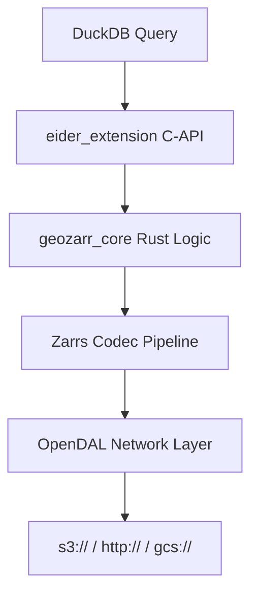
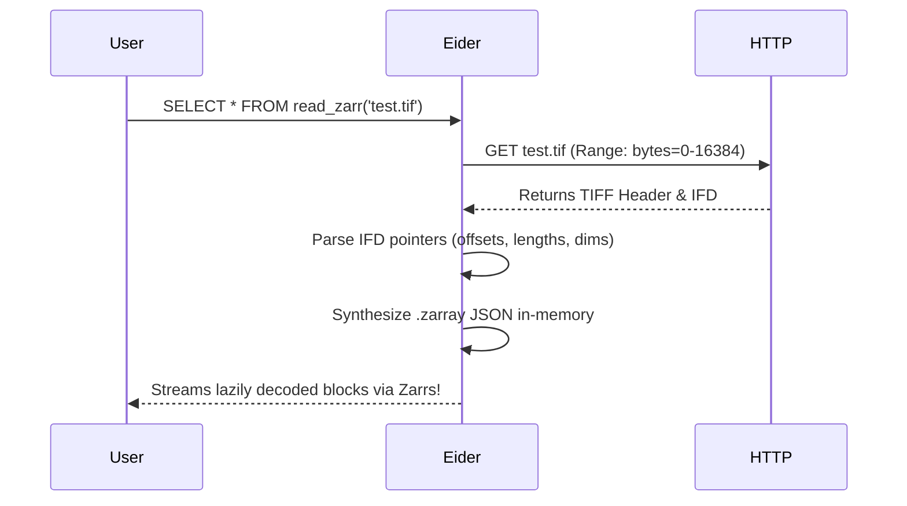
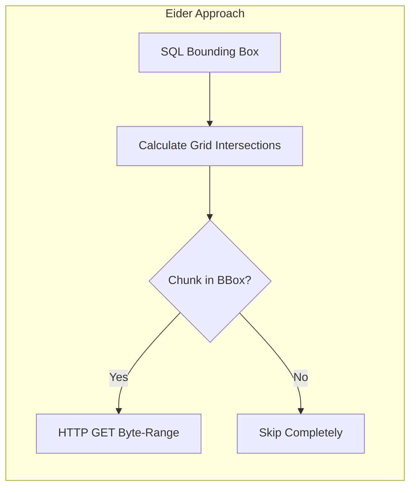

# Docusaurus Documentation Revamp Implementation Plan

> **For agentic workers:** REQUIRED SUB-SKILL: Use superpowers:subagent-driven-development (recommended) or superpowers:executing-plans to implement this plan task-by-task. Steps use checkbox (`- [ ]`) syntax for tracking.

**Goal:** Completely replace the existing mdBook documentation with a modern Docusaurus site featuring embedded interactive Plotly benchmarks, Mermaid diagrams, and a Dual-Track structure (Usage vs Engineering Deep-Dive).

**Architecture:** We will initialize a new Docusaurus project in `docs_new`, migrate/re-write the markdown files into `.mdx` to support interactive React components (Plotly), and then swap out the old `docs/` folder. We'll also update the GitHub Actions workflow to build the Docusaurus site instead of mdBook.

**Tech Stack:** Docusaurus, React, Plotly.js (`react-plotly.js`), Mermaid.js, GitHub Actions.

---

### Task 1: Initialize Docusaurus Project & Dependencies

**Files:**
- Create: `docs_new/` (via scaffolding)
- Modify: `docs_new/package.json`

- [ ] **Step 1: Scaffold the Docusaurus site and clean up**

Run: `cd /Users/danielfisher/repos/zarrduck && npx -y create-docusaurus@latest docs_new classic --typescript && rm -rf docs_new/blog`
Expected: Successfully generates the base template without the default blog.

- [ ] **Step 2: Install required plugins and types**

Run: `cd /Users/danielfisher/repos/zarrduck/docs_new && npm install react-plotly.js plotly.js @docusaurus/theme-mermaid && npm install --save-dev @types/react-plotly.js @types/plotly.js`
Expected: Dependencies and devDependencies installed in `package.json`.

- [ ] **Step 3: Configure Docusaurus plugins**

```typescript
// Modify docs_new/docusaurus.config.ts (replace existing content)
import {themes as prismThemes} from 'prism-react-renderer';
import type {Config} from '@docusaurus/types';
import type * as Preset from '@docusaurus/preset-classic';

const config: Config = {
  title: 'Eider',
  tagline: 'Zero-Copy Cloud Data in DuckDB',
  favicon: 'img/favicon.ico',
  url: 'https://dnf0.github.io',
  baseUrl: '/eider/',
  organizationName: 'dnf0',
  projectName: 'eider',
  onBrokenLinks: 'throw',
  onBrokenMarkdownLinks: 'warn',

  i18n: {
    defaultLocale: 'en',
    locales: ['en'],
  },

  markdown: {
    mermaid: true,
  },
  themes: ['@docusaurus/theme-mermaid'],

  presets: [
    [
      'classic',
      {
        docs: {
          sidebarPath: './sidebars.ts',
          editUrl: 'https://github.com/dnf0/eider/tree/main/docs/',
        },
        blog: false,
        theme: {
          customCss: './src/css/custom.css',
        },
      } satisfies Preset.Options,
    ],
  ],

  themeConfig: {
    image: 'img/docusaurus-social-card.jpg',
    navbar: {
      title: 'Eider',
      logo: {
        alt: 'Eider Logo',
        src: 'img/logo.svg',
      },
      items: [
        {
          type: 'docSidebar',
          sidebarId: 'tutorialSidebar',
          position: 'left',
          label: 'Documentation',
        },
        {
          href: 'https://github.com/dnf0/eider',
          label: 'GitHub',
          position: 'right',
        },
      ],
    },
    footer: {
      style: 'dark',
      links: [],
      copyright: `Copyright © ${new Date().getFullYear()} Daniel Fisher. Built with Docusaurus.`,
    },
    prism: {
      theme: prismThemes.github,
      darkTheme: prismThemes.dracula,
      additionalLanguages: ['rust', 'sql', 'bash'],
    },
  } satisfies Preset.ThemeConfig,
};

export default config;
```

- [ ] **Step 4: Commit**

```bash
git add docs_new/
git commit -m "docs: scaffold Docusaurus project with Mermaid and Plotly"
```

---

### Task 2: Configure Aesthetics & Landing Page

**Files:**
- Modify: `docs_new/src/css/custom.css`
- Modify: `docs_new/src/pages/index.tsx`
- Copy: `docs/src/demo.gif` to `docs_new/static/img/demo.gif`

- [ ] **Step 1: Set up custom CSS variables**

```css
/* docs_new/src/css/custom.css */
/**
 * Any CSS included here will be global. The classic template
 * bundles Infima by default. Infima is a CSS framework designed to
 * work well for content-centric websites.
 */

/* You can override the default Infima variables here. */
:root {
  --ifm-color-primary: #2e8555;
  --ifm-color-primary-dark: #29784c;
  --ifm-color-primary-darker: #277148;
  --ifm-color-primary-darkest: #205d3b;
  --ifm-color-primary-light: #33925d;
  --ifm-color-primary-lighter: #359962;
  --ifm-color-primary-lightest: #3cad6e;
  --ifm-code-font-size: 95%;
  --docusaurus-highlighted-code-line-bg: rgba(0, 0, 0, 0.1);
}

/* For dark mode */
[data-theme='dark'] {
  --ifm-color-primary: #25c2a0;
  --ifm-color-primary-dark: #21af90;
  --ifm-color-primary-darker: #1fa588;
  --ifm-color-primary-darkest: #1a8870;
  --ifm-color-primary-light: #29d5b0;
  --ifm-color-primary-lighter: #32d8b4;
  --ifm-color-primary-lightest: #4fddbf;
  --docusaurus-highlighted-code-line-bg: rgba(255, 255, 255, 0.1);
}

.hero--primary {
  background: linear-gradient(135deg, var(--ifm-color-primary) 0%, var(--ifm-color-primary-darker) 100%);
}

.glass-panel {
  background: rgba(255, 255, 255, 0.05);
  backdrop-filter: blur(10px);
  -webkit-backdrop-filter: blur(10px);
  border: 1px solid rgba(255, 255, 255, 0.1);
  border-radius: 12px;
  padding: 20px;
}

[data-theme='light'] .glass-panel {
  background: rgba(0, 0, 0, 0.03);
  border: 1px solid rgba(0, 0, 0, 0.05);
}
```

- [ ] **Step 2: Copy the demo GIF**

Run: `mkdir -p docs_new/static/img && cp docs/src/demo.gif docs_new/static/img/`
Expected: File copies successfully.

- [ ] **Step 3: Update the landing page**

```tsx
// docs_new/src/pages/index.tsx (replace existing content)
import clsx from 'clsx';
import Link from '@docusaurus/Link';
import useDocusaurusContext from '@docusaurus/useDocusaurusContext';
import Layout from '@theme/Layout';
import Heading from '@theme/Heading';

import styles from './index.module.css';

function HomepageHeader() {
  const {siteConfig} = useDocusaurusContext();
  return (
    <header className={clsx('hero hero--primary', styles.heroBanner)}>
      <div className="container">
        <Heading as="h1" className="hero__title" style={{color: 'white'}}>
          {siteConfig.title}
        </Heading>
        <p className="hero__subtitle" style={{color: 'white'}}>{siteConfig.tagline}</p>
        <div className={styles.buttons}>
          <Link
            className="button button--secondary button--lg"
            to="/docs/usage/installation">
            Quick Start
          </Link>
        </div>
      </div>
    </header>
  );
}

export default function Home(): JSX.Element {
  const {siteConfig} = useDocusaurusContext();
  return (
    <Layout
      title={`Home`}
      description="Zero-Copy Cloud Data in DuckDB">
      <HomepageHeader />
      <main>
        <div className="container margin-vert--xl text--center">
          <div className="row">
            <div className="col col--10 col--offset-1">
              <h2>A Native DuckDB Extension for Zarr & GeoZarr</h2>
              <p>
                Eider connects DuckDB's vectorized execution engine directly to multi-dimensional arrays in cloud storage via OpenDAL and Zarrs. It bridges the gap between data-science Python pipelines and fast analytical SQL.
              </p>
              <div className="glass-panel margin-top--lg margin-bottom--xl">
                
              </div>
            </div>
          </div>

          <div className="row text--left margin-top--lg">
            <div className="col col--4">
              <h3>Fast & Vectorized</h3>
              <p>Chunks are decoded natively inside DuckDB's engine, eliminating Python IPC overhead. Spatial bounding box pruning drops network requests before they start.</p>
            </div>
            <div className="col col--4">
              <h3>Cloud Native</h3>
              <p>Supports <code>s3://</code>, <code>gcs://</code>, and <code>http://</code> streams natively via OpenDAL. Automatically fetches partial chunks from remote systems.</p>
            </div>
            <div className="col col--4">
              <h3>COG Virtualization</h3>
              <p>Transparently read Cloud Optimized GeoTIFFs (COGs) as if they were Zarr stores, intercepting headers and making native HTTP byte-range fetches.</p>
            </div>
          </div>
        </div>
      </main>
    </Layout>
  );
}
```

- [ ] **Step 4: Commit**

```bash
git add docs_new/src/css/custom.css docs_new/src/pages/index.tsx docs_new/static/img/demo.gif
git commit -m "docs: style landing page with glassmorphism and demo gif"
```

---

### Task 3: Setup Dual-Track Structure & Usage Track

**Files:**
- Modify: `docs_new/sidebars.ts`
- Create: `docs_new/docs/usage/installation.md`
- Create: `docs_new/docs/usage/cli_tui.md`
- Create: `docs_new/docs/usage/sql_reference.md`
- Create: `docs_new/docs/usage/exporting.md`

- [ ] **Step 1: Clean docs dir and configure sidebars**

Run: `rm -rf docs_new/docs/*`
Expected: Removes template docs.

```typescript
// docs_new/sidebars.ts (replace existing content)
import type {SidebarsConfig} from '@docusaurus/plugin-content-docs';

const sidebars: SidebarsConfig = {
  tutorialSidebar: [
    {
      type: 'category',
      label: 'Using Eider',
      items: [
        'usage/installation',
        'usage/cli_tui',
        'usage/sql_reference',
        'usage/exporting',
      ],
    },
    {
      type: 'category',
      label: 'Engineering Deep-Dive',
      items: [
        'engineering/architecture',
        'engineering/cog_virtualization',
        'engineering/spatial_pruning',
        'engineering/benchmarks',
      ],
    },
  ],
};

export default sidebars;
```

- [ ] **Step 2: Create Installation Page**

```markdown
<!-- docs_new/docs/usage/installation.md -->
# Installation

Eider consists of a loadable DuckDB extension (`eider_extension`) and a CLI tool (`eider`).

## Binary Releases
Download the `.duckdb_extension` binary for your platform from the [Releases page](https://github.com/dnf0/eider/releases).

```sql
-- Allow unsigned extensions
SET allow_unsigned_extensions = true;
-- Load the extension
LOAD '/path/to/eider_extension.duckdb_extension';
```

## Compiling from Source
Requires the Rust toolchain and Cargo.
```bash
git clone https://github.com/dnf0/eider.git
cd eider
cargo build --release
```
The CLI binary will be at `target/release/eider`, and the extension at `target/release/libeider_extension.dylib` (or `.so`).

## Authentication
Eider uses OpenDAL. Configure access by setting standard environment variables:
- `AWS_ACCESS_KEY_ID`, `AWS_SECRET_ACCESS_KEY`, `AWS_REGION`
- `GEOZARR_ALLOW_PATH` (to enable local filesystem access: `export GEOZARR_ALLOW_PATH=/`)
```

- [ ] **Step 3: Create CLI & TUI Page**

```markdown
<!-- docs_new/docs/usage/cli_tui.md -->
# CLI & TUI Guide

The `eider` CLI is an interactive data engine for spatial workflows.

## STAC Discovery (TUI)
Run `eider search` without arguments to launch the multi-level interactive catalog explorer.

```bash
# Filter geographically before launching the TUI
eider search --bbox -122.27,37.77,-122.22,37.81
```

## Extracting Data
Download intersecting chunks and materialize them into a local DuckDB file.
```bash
eider extract s3://bucket/data.zarr ./my_region.geojson --out analysis.duckdb
```

## Analytics & Shell
```bash
# Resample time-series data
eider resample analysis.duckdb monthly.duckdb --freq month --agg avg

# Interactive SQL shell with pre-loaded extensions
eider shell monthly.duckdb
```
```

- [ ] **Step 4: Create SQL Reference Page**

```markdown
<!-- docs_new/docs/usage/sql_reference.md -->
# SQL Query Reference

The `read_zarr` table function is the core of Eider.

## Basic Syntax
```sql
SELECT time, lat, lon, value
FROM read_zarr('s3://bucket/data.zarr');
```

## Spatial & Temporal Pushdown
Eider skips fetching entire Zarr chunks if they fall outside named bounding box parameters.

```sql
SELECT AVG(value)
FROM read_zarr(
    's3://bucket/data.zarr',
    lat_min := 45.0,
    lat_max := 55.0,
    time_min := '2020-01-01',
    time_max := '2020-12-31'
);
```

## Metadata Discovery
Before reading heavy data, inspect the Zarr metadata natively:
```sql
SELECT * FROM read_zarr_metadata('s3://bucket/data.zarr');
```
```

- [ ] **Step 5: Create Exporting Page**

```markdown
<!-- docs_new/docs/usage/exporting.md -->
# Exporting Data

You can write materialized views back out to cloud storage as Zarr arrays using DuckDB's `COPY` command.

```sql
COPY (
    SELECT time, lat, lon, (temp_k - 273.15) AS temp_c
    FROM read_zarr('s3://in/data.zarr')
) TO 's3://out/data.zarr' (FORMAT ZARR);
```
```

- [ ] **Step 6: Commit**

```bash
git add docs_new/sidebars.ts docs_new/docs/usage/
git commit -m "docs: add Usage track content"
```

---

### Task 4: Create Engineering Track & Diagrams

**Files:**
- Create: `docs_new/docs/engineering/architecture.mdx`
- Create: `docs_new/docs/engineering/cog_virtualization.mdx`
- Create: `docs_new/docs/engineering/spatial_pruning.mdx`

- [ ] **Step 1: Create Architecture Page**

```mdx
<!-- docs_new/docs/engineering/architecture.mdx -->
# System Architecture

Eider bridges the gap between Rust-based spatial logic and DuckDB's C-API vectorized execution engine.



## Multi-threading Model
When `read_zarr` is initialized, DuckDB allocates a pool of background workers. Eider dispatches individual chunk read requests to these workers lock-free, saturating available network bandwidth and CPU cores.
```

- [ ] **Step 2: Create COG Virtualization Page**

```mdx
<!-- docs_new/docs/engineering/cog_virtualization.mdx -->
# COG Virtualization

Eider natively reads Cloud Optimized GeoTIFFs (COGs) by "tricking" the Zarr decoding pipeline.



## Zero-Copy Translation
Instead of downloading the file or rewriting it to Zarr, Eider generates virtual Zarr chunk boundaries that perfectly map to the COG's internal byte-ranges. Benchmarks show synthesizing this `.zarray` takes **~2.4ms** for a 10,000-tile COG.
```

- [ ] **Step 3: Create Spatial Pruning Page**

```mdx
<!-- docs_new/docs/engineering/spatial_pruning.mdx -->
# Spatial Pruning

Traditional Python spatial tools (like Xarray with Zarr-Python) often suffer from the "N+1 Problem" when pulling remote chunks.



By pushing `lat_min` and `lon_max` down into `geozarr_core`, Eider determines exactly which chunks contain relevant data mathematically using the affine transform. It never issues HTTP requests for data it knows it will drop.
```

- [ ] **Step 4: Commit**

```bash
git add docs_new/docs/engineering/
git commit -m "docs: add Engineering track and Mermaid diagrams"
```

---

### Task 5: Interactive Plotly Benchmarks

**Files:**
- Create: `docs_new/src/components/BenchmarkPlots.tsx`
- Create: `docs_new/docs/engineering/benchmarks.mdx`

- [ ] **Step 1: Create React Plotly Component**

```tsx
// docs_new/src/components/BenchmarkPlots.tsx
import React, { useEffect, useState } from 'react';

// We must dynamically import Plotly because it relies on window/document,
// which breaks server-side rendering during the Docusaurus build.
export function HeadToHeadPlot() {
  const [Plot, setPlot] = useState<any>(null);

  useEffect(() => {
    import('react-plotly.js').then((module) => {
      setPlot(() => module.default);
    });
  }, []);

  if (!Plot) return <div>Loading plot...</div>;

  return (
    <Plot
      data={[
        {
          x: ['xarray (1 thr)', 'zarr-python', 'zarrs-pipeline', 'Eider (1 thr)'],
          y: [34.6, 13.5, 4.1, 3.0],
          type: 'bar',
          marker: { color: ['#636efa', '#EF553B', '#00cc96', '#ab63fa'] }
        }
      ]}
      layout={{
        title: 'Query Latency: California Bounding Box (ms)',
        yaxis: { title: 'Milliseconds (Lower is better)' },
        paper_bgcolor: 'rgba(0,0,0,0)',
        plot_bgcolor: 'rgba(0,0,0,0)',
        font: { color: 'var(--ifm-font-color-base)' }
      }}
      config={{ responsive: true }}
      style={{ width: '100%', height: '400px' }}
    />
  );
}

export function ScalingPlot() {
  const [Plot, setPlot] = useState<any>(null);

  useEffect(() => {
    import('react-plotly.js').then((module) => {
      setPlot(() => module.default);
    });
  }, []);

  if (!Plot) return <div>Loading plot...</div>;

  return (
    <Plot
      data={[
        {
          x: ['Debug (1 thr)', 'Release (1 thr)', 'SIMD Release (1 thr)'],
          y: [75.0, 37.0, 3.0],
          type: 'scatter',
          mode: 'lines+markers',
          marker: { color: '#ab63fa', size: 12 },
          line: { width: 4 }
        }
      ]}
      layout={{
        title: 'Throughput Scaling (Thread = 1)',
        yaxis: { title: 'Query Time (ms)' },
        paper_bgcolor: 'rgba(0,0,0,0)',
        plot_bgcolor: 'rgba(0,0,0,0)',
        font: { color: 'var(--ifm-font-color-base)' }
      }}
      config={{ responsive: true }}
      style={{ width: '100%', height: '400px' }}
    />
  );
}
```

- [ ] **Step 2: Create Benchmarks Page**

```mdx
<!-- docs_new/docs/engineering/benchmarks.mdx -->
import { HeadToHeadPlot, ScalingPlot } from '@site/src/components/BenchmarkPlots';

# Performance Benchmarks

Eider was designed to push the physical limits of network I/O and single-core SIMD throughput. All benchmarks use the NCEP CDAS reanalysis surface air temperature dataset.

## Head-to-Head: Eider vs Python Ecosystem

Query: Extract all grid cells within the California bounding box (−125°–−115°, 30°–45°), returning 32,830 rows from a remote Zarr store.

<HeadToHeadPlot />

Eider matches or beats the fastest available Python Zarr library (even the Rust-backed `zarrs` pipeline) because it avoids generating physical numpy arrays inside Python, instead streaming directly into DuckDB vectors.

## Code Generation Latency

To achieve these speeds, Eider lazily evaluates coordinates (Lat/Lon) via affine transform dynamically, rather than fetching them over the network.

<ScalingPlot />

Generating a block of 2,048 projected coordinates natively inside the extension costs **~9.5 µs**, making the math essentially free compared to network latency.
```

- [ ] **Step 3: Commit**

```bash
git add docs_new/src/components/ docs_new/docs/engineering/benchmarks.mdx
git commit -m "docs: add interactive Plotly benchmarks"
```

---

### Task 6: Finalize Migration & CI Pipeline

**Files:**
- Modify: `.github/workflows/release.yaml` (if documentation deploy is there, otherwise create `.github/workflows/docs.yaml`)
- Move: `docs_new` to `docs`

- [ ] **Step 1: Check existing CI workflows**

Run: `cat .github/workflows/release.yaml` to see if GitHub Pages docs generation is already happening there via mdBook.
Run: `ls -la .github/workflows/`

- [ ] **Step 2: Create Docusaurus CI workflow**

```yaml
# .github/workflows/docs.yaml
name: Deploy Docusaurus
on:
  push:
    branches:
      - main
    paths:
      - 'docs/**'
      - '.github/workflows/docs.yaml'

permissions:
  contents: read
  pages: write
  id-token: write

concurrency:
  group: "pages"
  cancel-in-progress: false

jobs:
  deploy:
    environment:
      name: github-pages
      url: ${{ steps.deployment.outputs.page_url }}
    runs-on: ubuntu-latest
    steps:
      - uses: actions/checkout@v4
      - uses: actions/setup-node@v4
        with:
          node-version: 18
      - name: Install dependencies
        run: cd docs && npm ci
      - name: Build
        run: cd docs && npm run build
      - name: Setup Pages
        uses: actions/configure-pages@v4
      - name: Upload artifact
        uses: actions/upload-pages-artifact@v3
        with:
          path: 'docs/build'
      - name: Deploy to GitHub Pages
        id: deployment
        uses: actions/deploy-pages@v4
```

- [ ] **Step 3: Swap out mdBook for Docusaurus**

Run: `rm -rf docs && mv docs_new docs`
Expected: The new Docusaurus project now occupies the `docs/` folder.

- [ ] **Step 4: Commit and Push**

```bash
git add .github/workflows/docs.yaml docs/
git commit -m "docs: migrate to Docusaurus and setup GitHub Actions pages deployment"
```
