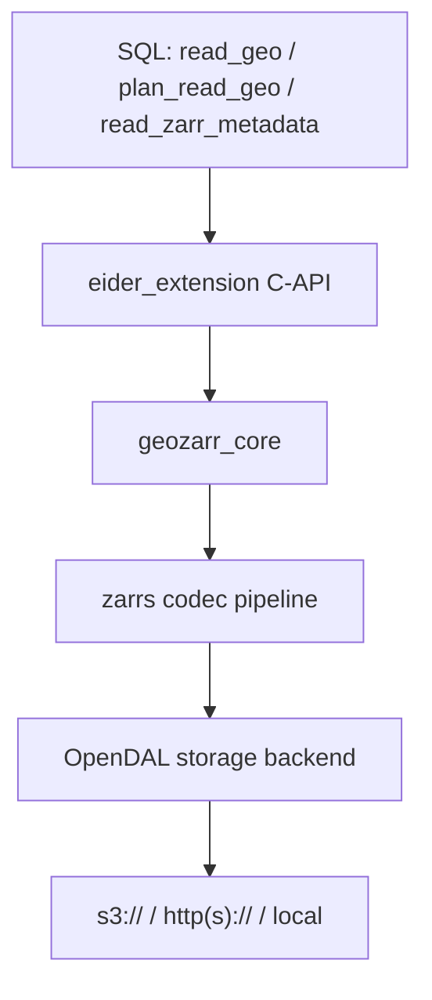
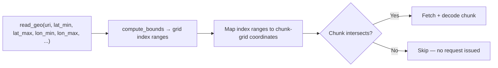
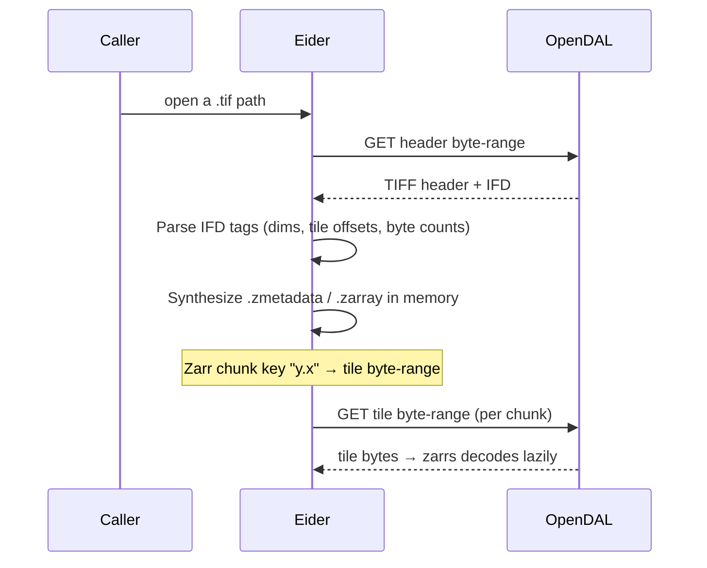

# Docs Workstream E (Engineering Deep-Dives) Implementation Plan

> **For agentic workers:** REQUIRED SUB-SKILL: Use superpowers:subagent-driven-development (recommended) or superpowers:executing-plans to implement this plan task-by-task. Steps use checkbox (`- [ ]`) syntax for tracking.

**Goal:** Rewrite the four `docs/docs/engineering/*.mdx` stubs into accurate, source-grounded deep-dives, correcting fabricated/imprecise claims and rebuilding the benchmarks page from real measured numbers.

**Architecture:** Pure docs edits to four `.mdx` pages plus deletion of one fabricated React component. The benchmarks page is rebuilt from the output of the repo's existing criterion benches (run live, not invented). Every retained claim is grounded in cited `file:line` from the audit in the spec.

**Tech Stack:** Docusaurus (MDX + mermaid), Rust criterion benchmarks (`cargo bench`).

---

## Conventions & prerequisites

Work from repo root `/Users/danielfisher/repos/eider` on branch `docs/workstream-e-engineering` (already created off `main`). Conventional Commits; every commit `--no-gpg-sign` and ends with:
`Co-Authored-By: Claude Opus 4.8 (1M context) <noreply@anthropic.com>`

The working tree may contain unrelated modified/untracked files (demo artifacts, scratch `.rs` files). **Never `git add -A`** — stage only the files each task names.

Docs build (the gate): `cd docs && (test -d node_modules || npm ci) && npm run build` — Docusaurus is configured `onBrokenLinks: 'throw'`.

Ground-truth source references are in the spec (`docs/superpowers/specs/2026-06-07-docs-workstream-e-design.md`, "Ground-truth source references"); cite from there.

## File structure

- Modify: `docs/docs/engineering/architecture.mdx` (Task 1)
- Modify: `docs/docs/engineering/spatial_pruning.mdx` (Task 2)
- Modify: `docs/docs/engineering/cog_virtualization.mdx` (Task 3)
- Modify: `docs/docs/engineering/benchmarks.mdx` + Delete `docs/src/components/BenchmarkPlots.tsx` (Task 4)
- Verify only: docs build, scope, no-fabrication grep (Task 5)

No sidebar change (`docs/sidebars.ts` "Concepts & Engineering" category keeps its four entries).

---

## Task 1: Rewrite `architecture.mdx` (correct the threading model)

**Files:** Modify `docs/docs/engineering/architecture.mdx`.

- [ ] **Step 1: Overwrite the page**

Write `docs/docs/engineering/architecture.mdx`:

````markdown
# System Architecture

Eider is a DuckDB extension that bridges DuckDB's C-API vectorized execution
engine with Rust-based geospatial logic. A SQL query flows through the
extension into `geozarr_core`, which drives the [`zarrs`](https://docs.rs/zarrs)
codec pipeline over an [Apache OpenDAL](https://opendal.apache.org/) storage
backend.



## Entry points

The extension registers three table functions (`extension/src/lib.rs`):

- `read_geo` — read array values, with spatial/temporal pushdown.
- `plan_read_geo` — dry-run cost estimate (`total_chunks`, `total_bytes`).
- `read_zarr_metadata` — array shape, chunk shape, data type, CRS.

A query binds in `ReadGeoVTab::bind()` (`extension/src/table_function.rs`),
which opens the dataset via `geozarr_core::dataset::ZarrDataset::open`. That
resolves a storage backend (`geozarr_core::store::resolve_sync_store`) and opens
the array through `zarrs`.

## Concurrency model

Eider does **not** run its own thread pool — it has no `tokio` or `rayon`
dependency in the extension. Instead it cooperates with DuckDB's query-engine
threads:

1. At bind time the extension calls `set_max_threads(num_chunks)`, telling
   DuckDB how much parallelism the scan can use (one unit of work per chunk).
2. DuckDB spins up worker threads. Each thread is handed a thread-local
   `LocalState` (keyed by thread id) that tracks its current chunk.
3. To get its next unit of work, a thread locks a shared `GlobalState`
   grid iterator (a `Mutex`) and pops the next chunk coordinate. It then
   reads and decodes that chunk independently and writes the result into its
   DuckDB output vector.

In other words, chunks are distributed across DuckDB's worker threads via a
**shared work-queue guarded by a mutex** — a small critical section to hand out
the next coordinate, with the expensive fetch/decode happening lock-free *per
thread*. (The mutex is a coordination point, so this is not a fully lock-free
design; for typical chunk counts the contention is negligible next to network
latency.) The async network I/O itself is driven by OpenDAL inside the store
wrapper.

## Codec & format support

The `zarrs` pipeline is built (`extension/Cargo.toml`) with support for the
**Blosc**, **Gzip**, **Zstd**, and **CRC32C** codecs, plus **sharding**,
**transpose**, and **ndarray** features. Both Zarr **V2** and **V3** arrays are
supported.
````

- [ ] **Step 2: Verify the corrected claims against source**

Confirm each claim still matches source (the implementer should open these and sanity-check, not trust the plan blindly):
- `set_max_threads(num_chunks)` and the `Mutex`-guarded grid iterator: `extension/src/table_function.rs` (~`:179`, `:67`, `:163-168`, `:208`).
- No `tokio`/`rayon`: `grep -E "tokio|rayon" extension/Cargo.toml` → no dependency entries.
- Codec list: `grep zarrs extension/Cargo.toml`.
If any detail differs, correct the page text to match reality before committing.

- [ ] **Step 3: Commit**

```bash
git add docs/docs/engineering/architecture.mdx
git commit --no-gpg-sign -m "docs: rewrite architecture page with accurate concurrency model

Co-Authored-By: Claude Opus 4.8 (1M context) <noreply@anthropic.com>"
```

---

## Task 2: Deepen `spatial_pruning.mdx`

**Files:** Modify `docs/docs/engineering/spatial_pruning.mdx`.

- [ ] **Step 1: Overwrite the page**

Write `docs/docs/engineering/spatial_pruning.mdx`:

````markdown
# Spatial Pruning

When you constrain a query with a bounding box, Eider fetches only the chunks
that intersect it. The bounds are pushed down into `geozarr_core` and resolved
to grid indices *before* any data is read, so non-matching chunks are never
requested over the network.



## From bounds to indices

The named parameters `lat_min`/`lat_max`/`lon_min`/`lon_max`/`time_min`/
`time_max` are bound in `extension/src/table_function.rs` and passed to
`ZarrDataset::compute_bounds`. For each dimension, Eider resolves the requested
value range to an index range one of two ways:

- **Coordinate-array dimensions** (the dimension has an explicit coordinate
  array, e.g. a `lat` array): a binary search (`partition_point`) over the
  sorted coordinate values maps each bound to an index
  (`geozarr_core/src/query_planner.rs`).
- **Affine-transform dimensions** (the dimension is described by a
  `scale`/`translation` transform rather than a stored array): the inverse
  transform `index = (value − translation) / scale` computes the index range
  directly, with no coordinate array fetched
  (`geozarr_core/src/dataset.rs`).

## From indices to chunks

The resolved per-dimension index ranges are converted to chunk-grid
coordinates, and the scan iterates **only** the chunks covering those ranges
(`extension/src/table_function.rs`). A chunk outside every dimension's range is
never enumerated, so no byte-range request is ever issued for it.

## Estimating the read first

`plan_read_geo` runs exactly this pruning logic but stops before fetching,
returning `total_chunks` and `total_bytes` for the chunks that *would* be read.
Use it to size a query before running it — see the
[SQL Reference](../usage/sql_plan_read_geo.md).
````

- [ ] **Step 2: Verify the link target and source claims**

- Confirm the cross-link resolves: `ls docs/docs/usage/sql_plan_read_geo.md`.
- Sanity-check `partition_point` (`query_planner.rs`) and inverse-transform (`dataset.rs`, `coordinates.rs`) still describe the real logic. Correct if drifted.

- [ ] **Step 3: Commit**

```bash
git add docs/docs/engineering/spatial_pruning.mdx
git commit --no-gpg-sign -m "docs: deepen spatial pruning page with the real index/chunk logic

Co-Authored-By: Claude Opus 4.8 (1M context) <noreply@anthropic.com>"
```

---

## Task 3: Honest rewrite of `cog_virtualization.mdx` (+ STAC note)

**Files:** Modify `docs/docs/engineering/cog_virtualization.mdx`.

- [ ] **Step 1: Overwrite the page**

Write `docs/docs/engineering/cog_virtualization.mdx`:

````markdown
# COG Virtualization

:::caution Experimental
COG virtualization is implemented at the `geozarr_core` library level and is
reachable by opening a `.tif`/`.tiff` path directly (and via a conditional
end-to-end test through `read_geo('*.tif')`). It is **not yet a first-class,
stable `read_geo` source**, and its internals may change.
:::

Eider can read a Cloud Optimized GeoTIFF (COG) without downloading or converting
it, by presenting the COG to the `zarrs` pipeline as if it were a Zarr array.



## How it works

1. **Parse the TIFF.** `geozarr_core/src/cog.rs` reads the byte-order mark and
   IFD offset, then extracts the tags it needs: image width/length (256/257),
   tile width/length (322/323), and the per-tile offsets and byte counts
   (324/325).
2. **Synthesize a virtual Zarr array.** `VirtualCogStore`
   (`geozarr_core/src/virtual_store.rs`) generates `.zmetadata` and `.zarray`
   JSON in memory describing an array whose chunk shape equals the COG's tile
   shape.
3. **Map chunks to byte-ranges.** A Zarr chunk key of the form `"y.x"` is
   translated to the corresponding tile's `(offset, length)` and served by a
   single OpenDAL range GET; `zarrs` then decodes the tile lazily.

`resolve_sync_store` (`geozarr_core/src/store.rs`) detects `.tif`/`.tiff` paths
and instantiates the `VirtualCogStore` automatically, so the rest of the
pipeline is identical to reading a real Zarr array.

## STAC (planned, not yet wired to SQL)

A `VirtualStacStore` exists in `geozarr_core` that parses a STAC Item, extracts
its COG assets, and composes them as a set of virtual COG stores
(`geozarr_core/src/store.rs`). However, the `read_geo` SQL function currently
**returns an explicit error** for STAC paths
(`extension/src/table_function.rs`) — STAC consumption from SQL is planned but
not yet wired up. Until then, STAC sources are not queryable through the
extension.
````

- [ ] **Step 2: Verify Docusaurus admonition + source claims**

- The `:::caution ... :::` admonition is standard Docusaurus syntax (works in `.mdx`); the build will confirm.
- Sanity-check `cog.rs`, `virtual_store.rs`, `store.rs`, and the STAC error in `table_function.rs` still match. Confirm **no** numeric perf claim remains: `grep -nE "2\.4 ?ms|[0-9]+ ?ms|µs" docs/docs/engineering/cog_virtualization.mdx` → no matches.

- [ ] **Step 3: Commit**

```bash
git add docs/docs/engineering/cog_virtualization.mdx
git commit --no-gpg-sign -m "docs: rewrite COG page accurately, label experimental, add STAC status

Co-Authored-By: Claude Opus 4.8 (1M context) <noreply@anthropic.com>"
```

---

## Task 4: Rebuild `benchmarks.mdx` from real numbers; delete the fabricated component

**Files:** Modify `docs/docs/engineering/benchmarks.mdx`; Delete `docs/src/components/BenchmarkPlots.tsx`.

- [ ] **Step 1: Run the real benches and record the medians**

```bash
cargo bench --bench coordinate_bench 2>&1 | tee /tmp/e_coord_bench.txt
cargo bench --package geozarr_core --bench scanner_bench 2>&1 | tee /tmp/e_scanner_bench.txt
```
Record criterion's reported median (the middle value of `time: [low median high]`) for each benchmark id. Expected ballpark (sanity check, from the audit): `populate_lat_batch_2048` ≈ **~10 µs**. Use the **actual** measured medians in Step 2.

**Fallback (only if a bench cannot run in this environment):** do NOT invent a number. In the table, write the benchmark's row with the measured column as `run locally (see below)` and keep the reproduce command — never carry a fabricated figure. Note which bench could not run in the commit message.

- [ ] **Step 2: Overwrite the page using the measured numbers**

Write `docs/docs/engineering/benchmarks.mdx`, substituting the medians from Step 1 where shown as `<MEASURED…>`:

````markdown
# Performance Benchmarks

Eider's hot paths are microbenchmarked with
[criterion](https://github.com/bheisler/criterion.rs). These are
single-machine microbenchmarks of specific operations — not cross-tool or
cross-dataset comparisons — included to show where time goes inside the
extension. Run them yourself with the commands in
[Reproducing these numbers](#reproducing-these-numbers).

## Measured results

| Benchmark | What it measures | Median |
|---|---|---|
| `populate_lat_batch_2048` | Generating 2,048 coordinate values from an affine transform (no network) | <MEASURED_COORD> |
| `scanner_read_chunk_subset_remote` | Reading a chunk subset from a remote store through the scanner | <MEASURED_SCANNER> |

**Coordinate generation is essentially free relative to I/O.** Because Eider
computes lat/lon from the array's affine transform on the fly
(`translation + index × scale`) rather than fetching coordinate arrays, a full
batch of 2,048 values costs microseconds — negligible next to the network round
trips that dominate a remote read. See
[Spatial Pruning](./spatial_pruning.mdx) for how that transform is also used to
prune chunks.

## Reproducing these numbers

The benchmarks live in the repo and use criterion:

```bash
# Coordinate generation (extension crate)
cargo bench --bench coordinate_bench

# Remote chunk-subset read (geozarr_core crate)
cargo bench --package geozarr_core --bench scanner_bench
```

Sources: `extension/benches/coordinate_bench.rs` and
`geozarr_core/benches/scanner_bench.rs`. Numbers vary with hardware, network,
and the remote store; treat them as order-of-magnitude, not absolute.
````

> Implementer note: the `scanner_read_chunk_subset_remote` row depends on network access. If it cannot run, apply the Step 1 fallback for that row only (`run locally (see below)`), keeping the coordinate row's real number.

- [ ] **Step 3: Delete the fabricated component and confirm nothing imports it**

```bash
grep -rn "BenchmarkPlots" docs/src docs/docs
```
Expected after editing the page: the only remaining reference is the file itself. Then:
```bash
git rm docs/src/components/BenchmarkPlots.tsx
grep -rn "BenchmarkPlots" docs/src docs/docs || echo "no references remain"
```
Expected: `no references remain`.

- [ ] **Step 4: Commit**

```bash
git add docs/docs/engineering/benchmarks.mdx
git commit --no-gpg-sign -m "docs: rebuild benchmarks page from real criterion numbers; drop fabricated plots

Co-Authored-By: Claude Opus 4.8 (1M context) <noreply@anthropic.com>"
```

---

## Task 5: Build & honesty verification

**Files:** none (verification only).

- [ ] **Step 1: Build the docs (gates broken links + dangling import)**

Run: `cd docs && (test -d node_modules || npm ci) && npm run build 2>&1 | tail -6`
Expected: `[SUCCESS]`, no "Broken link" errors, and no module-not-found error for `BenchmarkPlots` (its import must be gone).

- [ ] **Step 2: No fabricated/stale claims remain**

Run from repo root:
```bash
grep -rnE "lock-free|read_zarr\(|2\.4 ?ms|9\.5 ?µs|32,?830|HeadToHead|ScalingPlot|xarray|zarr-python" docs/docs/engineering/ || echo clean
```
Expected: `clean` (the corrected architecture page describes the mutex honestly and does not say "lock-free"; no fabricated figures, no head-to-head comparison, no stale `read_zarr(`). If `read_geo`/`read_zarr_metadata` legitimately appear, that's fine — the pattern above targets the *function-call* form `read_zarr(` and the fabricated tokens only.

- [ ] **Step 3: Confirm scope**

Run: `git diff --name-status origin/main..HEAD`
Expected exactly:
```
M	docs/docs/engineering/architecture.mdx
M	docs/docs/engineering/benchmarks.mdx
M	docs/docs/engineering/cog_virtualization.mdx
D	docs/src/components/BenchmarkPlots.tsx
M	docs/docs/engineering/spatial_pruning.mdx
A	docs/superpowers/plans/2026-06-07-docs-workstream-e.md
A	docs/superpowers/specs/2026-06-07-docs-workstream-e-design.md
```
(No Rust source changes, no `sidebars.ts` change.)

---

## Self-review notes (author checklist, already applied)

- **Spec coverage:** architecture threading correction (Task 1) ✓; spatial_pruning deepening (Task 2) ✓; COG honest rewrite + experimental label + STAC note, 2.4ms removed (Task 3) ✓; benchmarks rebuilt from real `cargo bench` numbers as a table + reproduce section, head-to-head/fabricated figures removed, `BenchmarkPlots.tsx` deleted (Task 4) ✓; build-green + no-fabrication grep + scope gate (Task 5) ✓; keep sidebar/no landing ✓; file:line grounding throughout ✓.
- **Placeholders:** the only deferred content is the two measured bench medians, which are filled from a live `cargo bench` run in Task 4 Step 1 (with an explicit no-invented-number fallback) — this is verification-driven, not a prose placeholder. All page prose is complete.
- **Consistency:** function names (`read_geo`/`plan_read_geo`/`read_zarr_metadata`), `set_max_threads(num_chunks)`, `VirtualCogStore`/`VirtualStacStore`, `partition_point`, `compute_bounds`, and the cross-links (`./spatial_pruning.md`, `../usage/sql_plan_read_geo.md`) are used consistently and match the spec's source references.
- **Link safety:** engineering pages link only to existing pages (sibling engineering pages, SQL Reference from B). No links to deleted assets.
- **Non-goals honored:** no Rust changes (benches are only *run*), no sidebar restructure, no new landing, no STAC/COG capability work.
